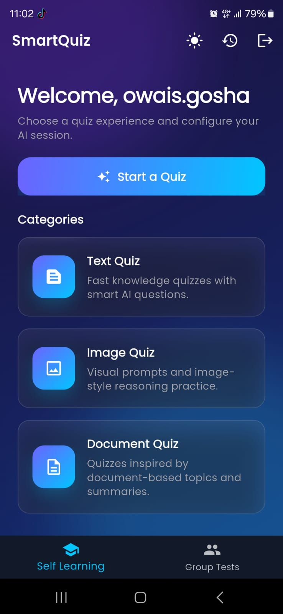
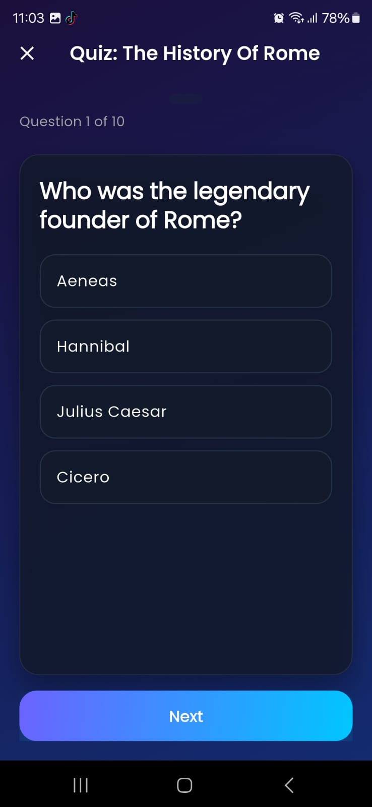
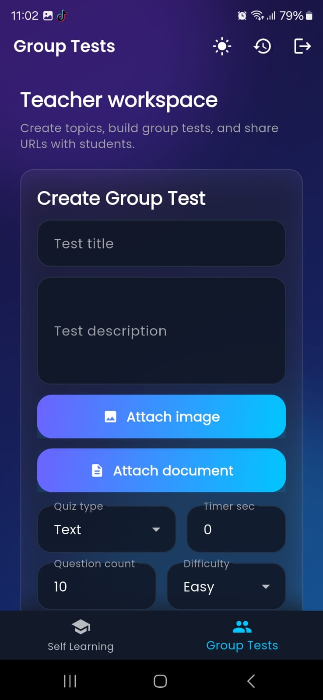

<div align="center">
	

	# SmartQuizAI

	AI-powered quiz generation app built with Flutter and Firebase.

	[](https://flutter.dev)
	[](https://dart.dev)
	[](https://firebase.google.com)
	[](LICENSE)
</div>

## Overview

SmartQuizAI helps users generate quizzes from topics using AI, attempt timed questions, and review results and history.

## Features

- Topic-based quiz generation
- Timed quiz sessions with progress tracking
- Result summary and historical performance
- Firebase integration for auth and data storage
- Cross-platform Flutter support (Android, iOS, Web, Desktop)

## Screenshots

| Home Screen | Quiz Screen | Teacher Workspace |
| --- | --- | --- |
|  |  |  |

## Tech Stack

- Flutter
- Dart
- Firebase Auth
- Cloud Firestore
- Firebase Realtime Database
- BLoC/Cubit state management

## Getting Started

### Prerequisites

- Flutter SDK installed
- Dart SDK (included with Flutter)
- Firebase project configured

### Installation

1. Clone the repository.
2. Install dependencies:

```bash
flutter pub get
```

3. Run the app:

```bash
flutter run
```

## Project Structure

```text
lib/
	core/
	features/
	shared/
	main.dart
assets/
	images/
screenshots/
```

## Configuration Notes

- Keep API keys and secrets out of source code.
- Use environment-based configuration or secure backend endpoints for AI keys.

## Contributing

Contributions are welcome. Open an issue or submit a pull request.

## License

This project is licensed under the MIT License.
